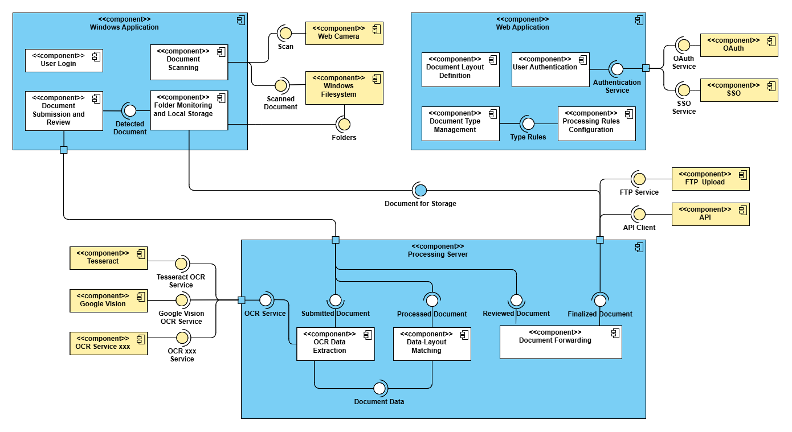

# docflow-server

> document processing system

This repository contains the processing server for a document processing system. It receives documents from a Windows application, processes them using OCR services, and maps extracted data to predefined layouts. After processing, the data is sent back for user verification and correction. Once finalized, the server forwards the document based on configured rules, such as saving it locally, uploading via FTP, or sending it to an external API. This repo focuses on the processing server, which interacts with separate repositories for the [Windows application](https://github.com/kanitakadusic/si-docflow-windows.git) and [admin dashboard](https://github.com/HarisMalisevic/si-docflow-admin.git).

## Architecture 🗂️

The component diagram of the system is provided below.  



## How To Use ⚙️

To clone and run this application, you will need [Git](https://git-scm.com/) and [Node.js](https://nodejs.org/).

```
# Clone this repository
$ git clone https://github.com/kanitakadusic/si-docflow-server.git

# Go into the root directory
$ cd si-docflow-server

# Install all dependencies
$ npm install

# Run the app in dev mode
$ npm run dev
```