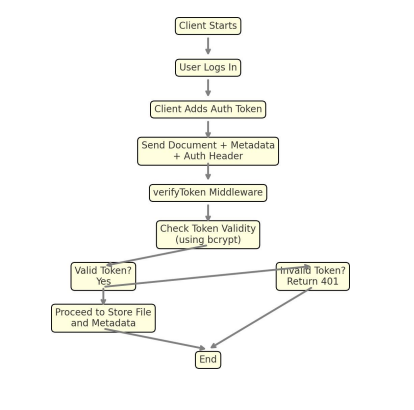

⚠️ Note: This documentation is outdated.

# Server-Side Documentation Sprint 3

## 1. Project Overview

Project Description:
The server component of "docflow" provides endpoints for secure document processing. In Sprint 3,
enhancements were made to improve the security of communication between the Windows client and the
backend API. This includes the implementation of token-based authentication and a dedicated authenticated
endpoint for document submission.

## 2. Installation and Launch

System Requirements:

- Node.js (version 18 or higher recommended)
- PostgreSQL database
- dotenv configuration file with DATABASE_URL

Installation:

- Clone the repository.
- Run `npm install` to install dependencies.
- Configure your `.env` file with database connection.
- Start the server using:
npm run dev # for development
npm run build # transpile TypeScript
npm start # run compiled JS

## 3. Application Architecture

Components:

- Express Server: Serves RESTful endpoints.
- Multer Middleware: Handles file uploads.
- Sequelize ORM: Interfaces with PostgreSQL database.
- Token Verification: Middleware to check valid authorization.
- Document Handling Routes: Handles file submission both public and secured.

## 4. Detailed Component Descriptions

Secure Document Submission:

- Route: POST /auth
- Function: Accepts file and metadata, but only if a valid token is present in the Authorization header.
- Middleware: verifyToken.ts checks if the token matches an active entry in the access_rights table (using
bcrypt for hashing).
- Tech Used: Express.js, Multer, Sequelize, Bcrypt

Public Document Submission:

- Route: POST /
- Function: Accepts document without token (for backwards compatibility or unauthenticated clients).
- Note: This route is kept for flexibility but not recommended for production.

verifyToken Middleware:

- Function: Extracts token from headers, compares it against the hashed token stored in the database, and
grants/denies access.
- Fails With:
- 401 Unauthorized if no token or invalid token
- 500 Server Error on DB failure

Database Models:

- access_rights Table:
- Fields: id, token (hashed), is_active
- document_types Table:
- Stores document categories and metadata for categorization

## 5. API Endpoints

Method | Endpoint | Auth Required | Description
POST | / | No | Submit document without token
POST | /auth | Yes | Submit document with token check

POST Payload:

- file: Uploaded file (PDF/JPG/PNG)
- user, type, pc: Metadata fields included via form-data

Token Header for /auth:

Authorization: your_token_here

## 6. Security Practices

- Hashed Token Verification using Bcrypt
- File Uploads Handled In-Memory (no untrusted disk access)
- Protected Endpoint prevents unauthorized submissions
- Active Flag in DB allows dynamic token revocation

## 7. Error Handling

Scenario | Server Response
-----------------------|-------------------------------
Missing Token | 401 - "No token provided"
Invalid Token | 401 - "Invalid token"
No Active Token in DB | 401 - "No active token found"
DB/Server Error | 500 - "Server error during verification"

All responses include JSON with an explanatory message.

## 8. Conclusion

Maintenance and Support:

- Security features are integrated and ready for extension.
- Future improvements may include refresh tokens and role-based access.

# Appendix: Secure Communication Flowchart

